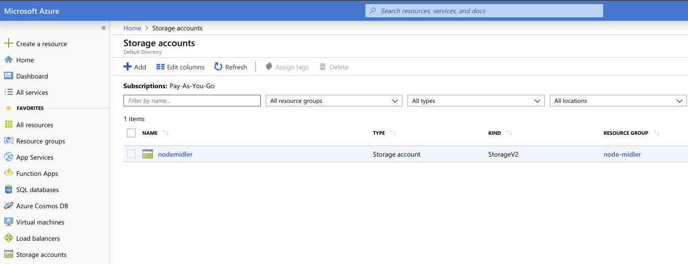
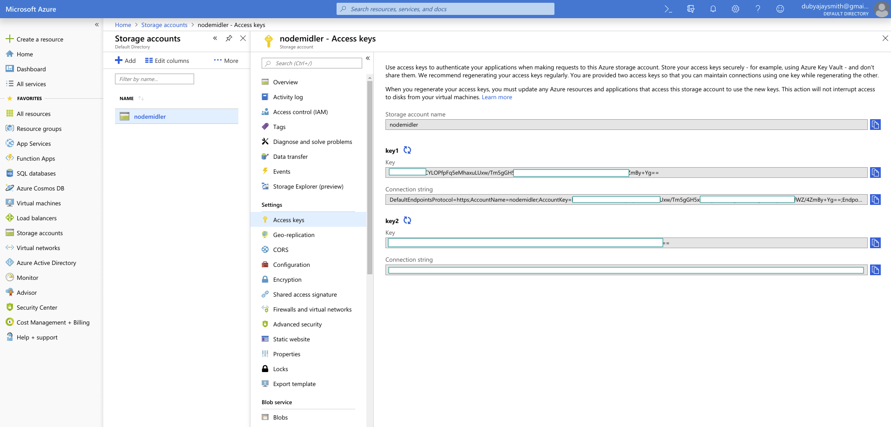
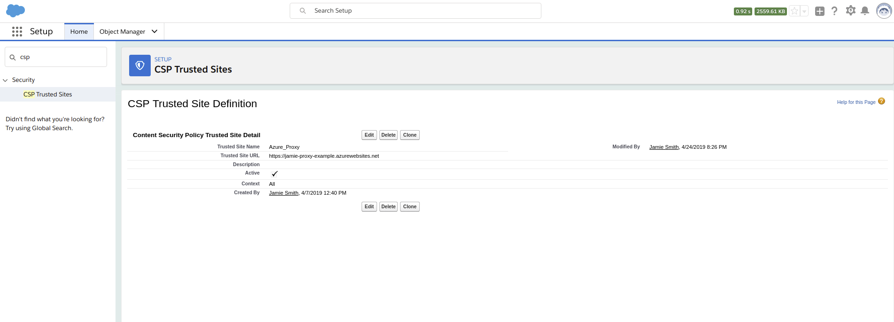
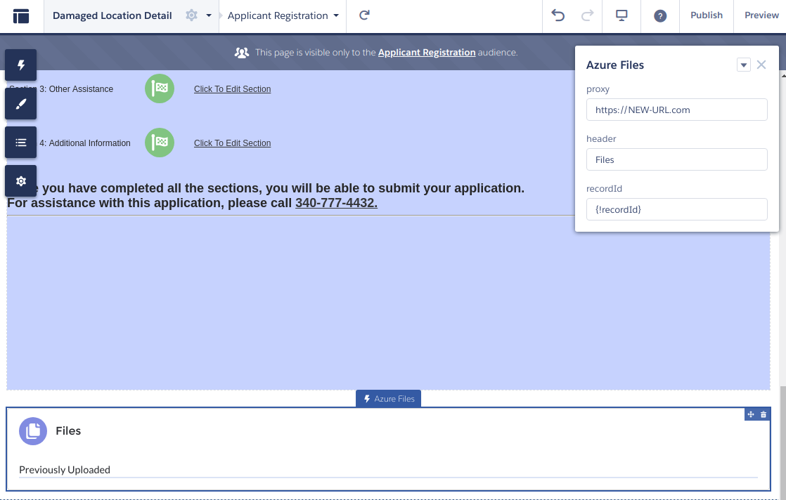

# Azure Files

## Deploy to Auze App Service

### Prerequisites

1. Install [VS Code](https://code.visualstudio.com/download)
 
2. Download and install the [Azure App Service extension](https://marketplace.visualstudio.com/items?itemName=ms-azuretools.vscode-azureappservice) for Visual Studio Code
    > There is also a [Azure Storage extension](https://marketplace.visualstudio.com/items?itemName=ms-azuretools.vscode-azurestorage) if interested
3. Wait for the extension to finish installing then reload Visual Studio Code when prompted
4. Once complete, you'll see an Azure icon in the Activity Bar
    > If your activity bar is hidden, you won't be able to access the extension. Show the Activity Bar by clicking View > Appearance > Show Activity Bar
5. Sign in to your Azure Account by clicking Sign in to Azure…
    >  If you don't already have an Azure Account, click "Create a Free Azure Account" or you can [try Azure for free](https://code.visualstudio.com/tryappservice/?utm_source=appservice-extension)

### Deploy

Once you are signed in to your Azure account and you have your app open in Visual
Studio Code, click the deploy button in the Azure App Service explorer - it's
the blue up arrow - to deploy your app.

> Tip: Be sure that your application is listening on the port provided by the PORT environment variable: `server.listen(process.env.PORT)`

1. Choose **Create New App**
2. Type a globally unique name for your Web App and press Enter. Valid characters for an app name are 'a-z', '0-9', and '-'
3. Choose your **Node.js version**, LTS is recommended
4. Select your current workspace if you have your app open already or browse to the directory containing your application code

Click **Yes** when prompted to update your configuration to run `npm install` on the target server.

Once the deployment starts, you're prompted to update your workspace so that subsequent deploys from this workspace automatically deploy to the same App Service web app. Choose **Yes** to ensure your changes are deployed to the correct app - you can change this later by editing your workspace settings (in `.vscode/settings.json`).

Once the deployment completes, click **Browse Website** in the prompt to view your freshly deployed proxy.

> The URL that **Browse Website** above leads you to is the URL for the new proxy instance which will be needed in next steps. We'll refer to this as the Proxy URL below.

### Proxy 

Now that there's a new Azure account, we'll need to update this proxy to reflect that.

There's a [config.json](config.json) file for anything that may change. This is where the Azure Account name (1), key (2) and secret (3) are stored.

1. Get the Storage Account Name and update account in config.json

2. Click on the name above

- set the key (2) to the Key value

- set the secret (3) to the Connection string value

> While you're in the config.json, this would be a good time to be sure the correct Salesforce URL is whitelisted. The URL will be the hostname (https://example.com) of the community you will use builder for in the next section (Salesforce #2).

### Salesforce

Now that there's a new Proxy URL, we'll need to update Salesforce to reflect that.

In Setup Menu

1. Add Proxy URL to CSP Trusted Site / Remote Site Settings

In the Community Buider

2. Click on LWC to update the attribute *proxy* with the Proxy URL

That should complete the deployment & setup.

---

## Additional Info

Uses Salesforce Id as container name for data structure but...

Azure containers must be lowercase so LWC has logic to handle trasitions to/from lowercase with dash before capitals: 123abCdefGH <--> 123ab-cdef-g-h

### Normal Install (via local or remote terminal)

    npm install

### run

    npm run start

---

@[Jamie](mailto:jamie.smith@coastalcloud.us)